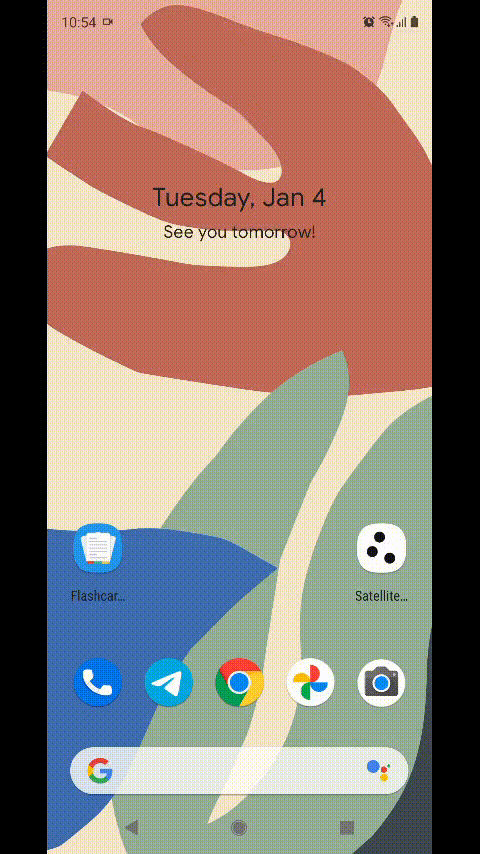
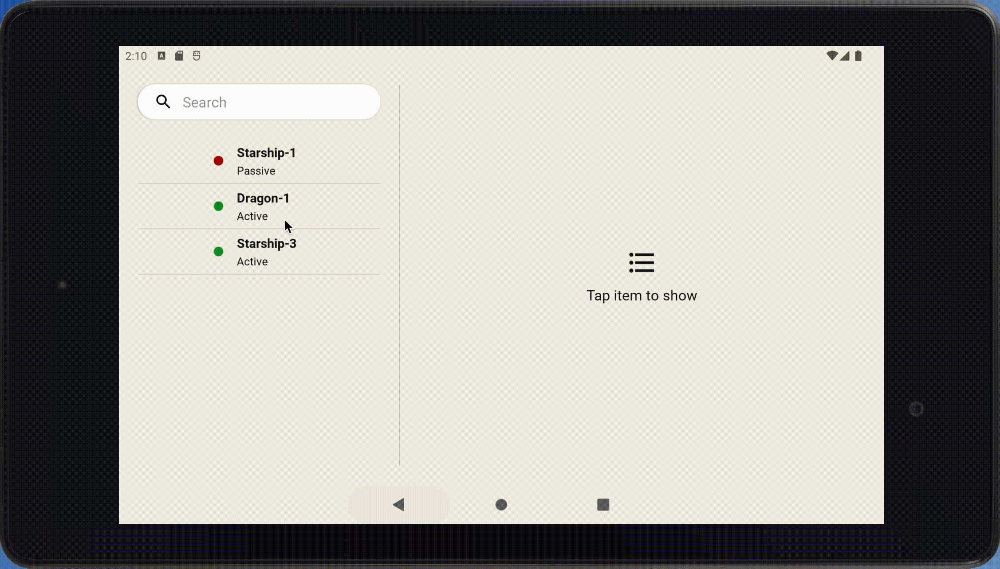

# Satellite Tracker: MVVM + Coroutine + Flow = 🦾

Hi there
In this project, I created a fully modular app with MVVM and Clean Architecture. Used navigation component for implementing single activity and decreasing the features dependencies through Deeplink. Used Moshi for parsing the initial data from the assets folder to cache them on the database with Room. Also with help of Flow, I let coroutine get the data flow in hand. Also, I created a custom workaround to manage modules dependencies. Created master view design for tablets. With help of Flow, I was able to build reactive UI to implement optimized search functionality. and I tested the app via Mockk library to test my view models and UI's

Compatible with Android M and above.

## Tech and Libraries Used:
- MVVM
- Clean Architecture
- Hilt
- Coroutine
- Flow
- Mockk
- Navigation Component  
- Espresso(UI Test)
- Junit(Unit Test)
- Room
- Moshi
- Custom Kotlin DSL
- Modular
- Master View Design in Tablet Mode
- Compatible with Android M and above

# Clone and take a look inside
